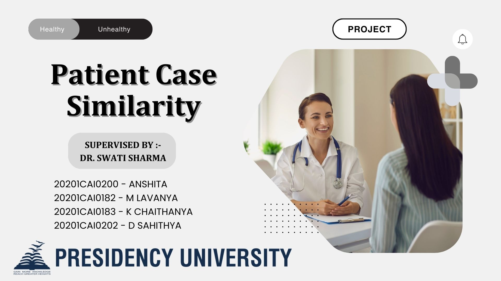

<h1> PATIENT CASE SIMILARITY </h1>

<h2> ABSTRACT </h2>
<h3>This research investigates the use of sophisticated deep neural networks to reveal synergistic accuracy in the analysis of similar patient cases. Using state-of-the-art methods, our research explores the complex interactions among various medical scenarios. The results demonstrate the potential of deep learning in interpreting complicated patient circumstances, which advances knowledge and personalized approaches in healthcare.</h3>

<h2> INTRODUCTION </h2>
<h3> Healthcare is constantly evolving and the focus on precise diagnosis and treatment has become more important than ever. However, one of the biggest challenges is finding the similarities between patient cases that can be quite complex. That's where our research comes in. We're exploring how Deep Neural Networks (DNNs) can help us better understand patient cases and uncover the subtle relationships that exist between them. Our research is called "Unveiling the Synergistic Precision" and it's all about using advanced computational methods and healthcare analytics to make breakthroughs in personalized medicine. We're taking a "deep dive" into neural networks to see how they can help us decipher complicated medical data and uncover new insights into how patients can be treated. The idea behind "synergistic precision" is that by combining DNNs with patient data, we can better understand each patient's unique case and tailor their treatment accordingly. This is a big step beyond traditional methods, which often miss the subtle nuances that can make a big difference in a patient's care. We believe that our research will help refine clinical decision support systems and ultimately lead to more personalized medical interventions. Our paper doesn't just focus on the technical aspects of using DNNs in healthcare. We also look at how this technology can impact healthcare practitioners and the entire field of personalized medicine. By unveiling the potential of DNNs, we're creating a future where artificial intelligence and healthcare come together to redefine the standard of care. We're excited to take this journey and invite everyone to join us as we explore the potential of cutting-edge deep neural networks in reshaping patient-centric healthcare. </h3>
